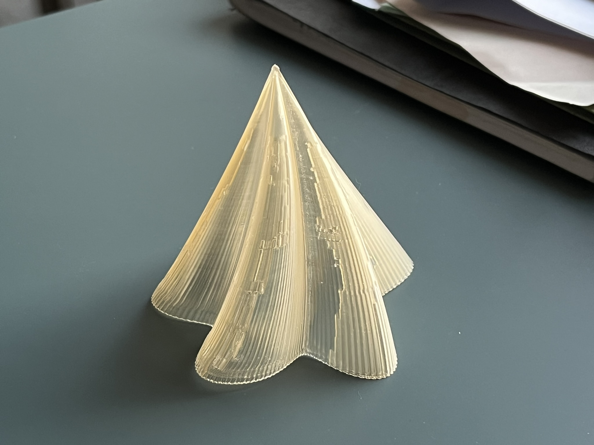

## How to print
In BambuStudio I use the following settings:
* Wall loops: 2 (or 1 if you want extra transparency)
* Raft layers: 1
* Bottom shell layers: 0
* Infill: 0%
* Ensure vertical shell thickness: Off (to prevent the irregularity that you see in the test print above)

Modifying the layer–scale relationship allows you to choose between pointy (linear), dome shaped (square root or other powers below 1.0), etc. shapes.

```python
...
def ring_vertices(profile_xy: np.ndarray) -> np.ndarray:
    N = profile_xy.shape[0]
    M = n_layers
    zs = np.linspace(0.0, height_mm, M)
    thetas = np.linspace(0.0, total_twist_rad, M)
    verts = np.empty((M * N, 3), dtype=float)
    for i, (z, th) in enumerate(zip(zs, thetas)):
        scale = (M - i - 1) / (M - 1)
        xy_rot = rotate_xy(profile_xy, th)
        verts[i * N:(i + 1) * N, 0:2] = xy_rot * np.sqrt(scale) # dome shaped
        verts[i * N:(i + 1) * N, 2] = z
    return verts
...
```

The code was predominantly generated by ChatGPT.